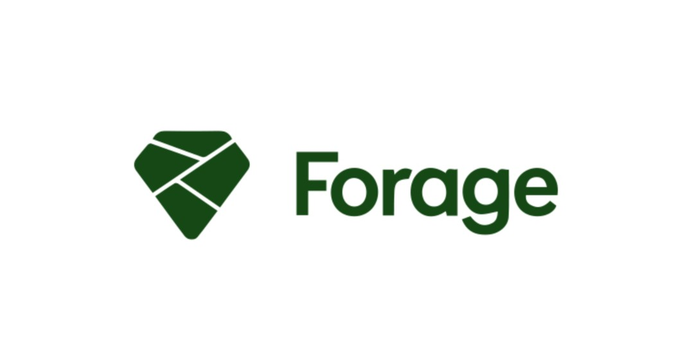

<h1 align="center"> 
     
    
Programa de trabalho virtual - Cibersegurança

     
    
    
&

    
</h1>

# 📘 Sobre Forage 
[Forage](https://www.theforage.com) é uma plataforma que busca
permitir que estudantes, de qualquer origem, a capacidade de aprimorar suas habilidades e conquistar carreiras incríveis.
Lançado em 2017, o Forage inventou a simulação de trabalho. Damos a qualquer estudante, de qualquer ponto de partida diversificado no mundo, a oportunidade de ver os bastidores das melhores empresas do mundo e iniciar carreiras lá - 100% gratuito e individual.
# 📙 Sobre JPMorgan Chase & Co.
A [JPMorgan Chase & Co.](https://www.jpmorgan.com/global) é uma sociedade gestora de participações sociais incorporada sob a lei de Delaware em 1678 e sediada em Nova Iorque, é a instituição líder mundial em serviços financeiros e a terceira maior empresa do mundo.
# 📗 Sobre o programa
Com a tecnologia a tornar-se mais avançada do que nunca, o mesmo acontece com as formas de os hackers cometerem fraudes. É por isso que precisamos de profissionais de cibersegurança para manter, mesmo as maiores empresas financeiras do mundo, a salvo de fraudes.

Nós, na JPMorgan Chase & Co., estamos a dar-lhe a oportunidade de adquirir competências básicas de cibersegurança para que possa decidir se quer seguir esta carreira profissionalmente. Veja como é realmente trabalhar numa equipe de cibersegurança!

## Task 1.
**Analisar um grande conjunto de dados sobre fraudes em serviços de pagamentos financeiros.**

Trabalhar com dados de sistemas críticos de segurança
- Python
- Numpy
- Matplotlib

## Task 2.
**Saiba mais sobre os fundamentos da segurança de aplicativos e coloque-os em prática no seu próprio site.**

Ganhe consciência do que precisa de ser protegido
- Python
- Django
- OTP Token (Autenticação de 2 fatores)

## Task 3.
**Spam ou Ham? Crie um classificador de correio eletrônico.**

Filtre os maus e-mails para proteger os seus colega
- Python
- SciKitLearn
- Pandas
- I.A
_____________________________________

### *📁 Acesse os diretórios para dar uma melhor olhada em cada Task.*
