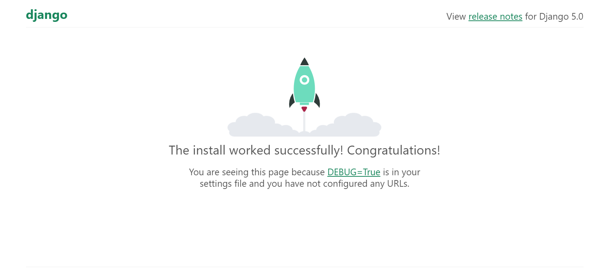
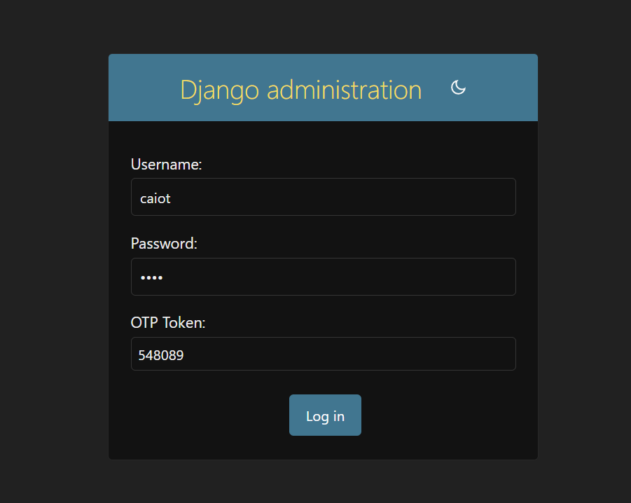
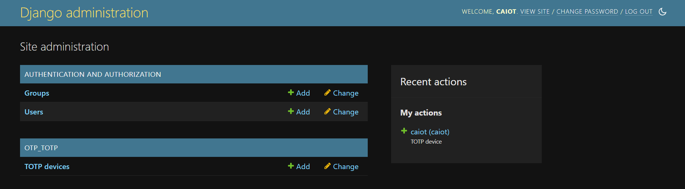

# Aplicação Web Django + OTP
<h1 align="center"> 
    
</h1>

*Esta Task consiste na configuração de uma aplicação web Django com funcionalidade de Senha Única (OTP) para garantir a segurança ao acesso da rota /admin.* 

# 📗 Sobre Django:
Django é um framework para desenvolvimento rápido para web, escrito em Python, que utiliza o padrão model-template-view. Foi criado originalmente como sistema para gerenciar um site jornalístico na cidade de Lawrence, no Kansas. Tornou-se um projeto de código aberto e foi publicado sob a licença BSD em 2005.

## Pré-requisitos

Certifique-se de ter o Python3 instalado na sua máquina. Você pode verificar isso digitando `python` ou `python3` no seu terminal. Se o Python estiver instalado, o interpretador Python deve aparecer.

## Configuração do Ambiente

Para manter este projeto isolado do restante da sua máquina, você pode criar um ambiente virtual usando um dos seguintes métodos:

### Usando Anaconda / Miniconda

1. Instale o Anaconda ou Miniconda, se ainda não o fez.
2. Crie um novo ambiente:
    ```sh
    conda create --name forageenv python=3.9
    ```
3. Ative o ambiente:
    ```sh
    conda activate forageenv
    ```

### Usando venv

1. Crie um ambiente virtual:
    ```sh
    python3 -m venv forageenv
    ```
2. Ative o ambiente:
    - No macOS/Linux:
        ```sh
        source forageenv/bin/activate
        ```
    - No Windows:
        ```sh
        forageenv\Scripts\activate
        ```

### Usando Outra Ferramenta

Se você preferir outra ferramenta para gerenciamento de ambiente, use-a como normalmente faria.

## Configuração do Projeto

1. Descompacte o arquivo `mysite.zip`.
2. Navegue até o diretório do projeto:
    ```sh
    cd mysite
    ```
3. Instale os módulos Python necessários:
    ```sh
    pip3 install -r requirements.txt
    ```
4. Sincronize o banco de dados com a configuração existente e crie-o se não existir:
    ```sh
    python3 manage.py migrate
    ```
5. Crie o usuário administrador do site:
    ```sh
    python3 manage.py createsuperuser
    ```
    Insira o nome de usuário, email e senha de sua escolha.
6. Execute a aplicação web:
    ```sh
    python3 manage.py runserver
    ```

## Integração com OTP

Siga a [documentação de instalação do Django OTP](https://django-otp-official.readthedocs.io/en/stable/overview.html#installation) e modifique o `settings.py`. Usaremos o plugin `otp_totp`.

### Passos:

1. Pare o servidor web em execução com `Ctrl-C`.
2. Modifique o `settings.py` conforme a documentação do Django OTP. Você precisará modificar duas variáveis.
3. Aplique as migrações novamente:
    ```sh
    python3 manage.py migrate
    ```
4. Execute a aplicação web:
    ```sh
    python3 manage.py runserver
    ```

### Modificar urls.py

Adicione o seguinte após as instruções de importação existentes em `urls.py`:

```python
from django_otp.admin import OTPAdminSite
admin.site.__class__ = OTPAdminSite
```
<br>
<br>
<br>
<h1 align="center"> 
    
</h1>

<h1 align="center"> 
    
    OTP Token conectado ao Google Authenticator do meu celular.
</h1>

<br>

<h1 align="center"> 
    
</h1>

### Ao adicionar a funcionalidade OTP a rota para página de Administradores fica protegida pela autenticação de 2 fatores.
